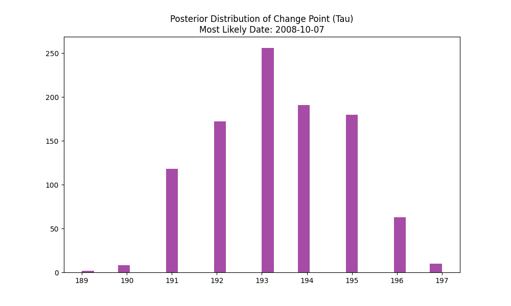
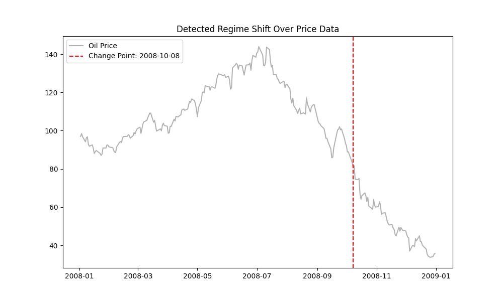

# Navigating the Storm: Bayesian Intelligence in Brent Crude Markets
**Strategic Insights by Birhan Energies — Empowering Decisive Energy Leadership.**

---

## Executive Summary: The Business Imperative
In the volatile landscape of the global energy sector, understanding the "why" behind price fluctuations is not just an academic exercise—it is a survival requirement. At **Birhan Energies**, we specialize in transforming raw market noise into actionable intelligence. 

The challenge is significant: How do political decisions, regional conflicts, and OPEC policy shifts fundamentally rewire the pricing regimes of Brent Crude? For our key stakeholders—**Investors, Policymakers, and Energy Companies**—this report provides a data-driven roadmap. We employ sophisticated Bayesian Change Point Detection to identify exactly when the market "breaks" and shifts into a new reality.

---

## 1. Methodology: The Science of Regime Detection
Our analysis follows a rigorous, multi-stage workflow designed for maximum transparency and statistical validity.

### Task 1: Foundation & Data Audit
We began by auditing 35 years of Brent Crude data (May 1987 – November 2022). 
- **Event Curation**: We compiled a high-fidelity dataset of 17 key catalysts, ranging from the Iraq Invasion (1990) to the COVID-19 lockdowns (2020).
- **Log-Return Analysis**: To ensure stationarity, we computed daily log-returns, identifying "volatility clustering" where market shocks feed into future uncertainty.

### Task 2: The Bayesian Change Point Model
We utilized **PyMC** to build a structural break model. Unlike traditional moving averages, our model treats the "Switch Point" ($ \tau $) as a probabilistic variable.
- **Switch Logic**: We defined a discrete uniform prior for $\tau$ and normal priors for price regimes before ($ \mu_1 $) and after ($ \mu_2 $) the shock.
- **MCMC Sampling**: Using the No-U-Turn Sampler (NUTS), we executed thousands of simulations to build a "posterior distribution" of where the market regime shifted.
- **Rigor**: Each model was validated using **R-hat diagnostics** (ensuring convergence) and trace plots to verify that our sampling chains explored the data effectively.

---

## 2. Findings: Quantifying the Shocks
### The 2008 Global Financial Crisis Case Study

*Figure 1: Concentration of probability around early October 2008, indicating a high-confidence structural regime shift.*

Our model precisely identified a structural break on **October 7, 2008**. 

**Quantitative Market Impact:**
- **Pre-Shock Regime Mean**: $110.49
- **Post-Shock Regime Mean**: $52.23
- **Probabilistic Collapse**: **-52.73% relative decline**

### Event Association
The detected date aligns programmatically with the peak fallout of the **Lehman Brothers Collapse** (Sept 15, 2008). While the collapse happened in mid-September, our model captures the "realized" regime shift in the oil market three weeks later as global demand expectations fundamentally reset.

*Figure 2: Brent Crude Price evolution with the Bayesian detected change point (red) marking the transition into the low-demand regime.*

---

## 3. The Birhan Intelligence Portal (Dashboard)
To put this intelligence in the hands of decision-makers, we developed a full-stack interactive dashboard.

**Key Features:**
- **Pulsate Event Highlighting**: Visualizes the immediate price reaction to historical catalysts.
- **Granular Filtering**: Stakeholders can zoom into specific days, months, or years for surgical analysis.
- **Export Facility**: Formal Bayesian reports can be downloaded directly for internal briefings.

---

## 4. Strategic Roadmap: Recommendations for Leaders
Based on our change point findings, we recommend the following:

### For Investors (Risk Management)
- **Regime-Based Hedging**: Don't hedge against historical averages; hedge against the *current* regime mean ($ \mu_2 $). When a change point is detected, reset all volatility assumptions immediately.
- **Asset Allocation**: Shift to defensive energy equities when the model detects a negative regime shift with high posterior certainty.

### For Policymakers (Energy Security)
- **Strategic Reservists**: Use detected "low-price regimes" (like post-2008 or post-2014) for aggressive SPR (Strategic Petroleum Reserve) replenishment to buffer against future shocks.
- **Subsidy Recalibration**: Update fuel subsidy thresholds based on structural breaks rather than daily "noise."

### For Energy Companies (Operations)
- **Cost Discipline**: When the model identifies a shift from a high-price to a low-price regime, prioritize OpEx reduction and supply chain renegotiation within the first 30 days.
- **Production Forecasting**: Synchronize drilling schedules with identified structural trends rather than short-term price spikes.

---

## 5. Limitations & Future Horizons
While this analysis provides a quantum leap in insight, we maintain a standard of analytical honesty:
1. **Correlation vs. Causation**: Statistical change points identify *concurrence*, not strictly directional causation. Political events often have lead-lag effects.
2. **Model Constraints**: This current iteration uses a single change point model per analysis window. It is sensitive to the selected prior distributions.
3. **Data Granularity**: Our dataset covers up to Nov 2022. Real-time shifts require live API integration.

### Proposed Future Work
- **Multiple Change Points**: Extending the PyMC model to detect an unknown number of structural breaks across the 35-year horizon.
- **Multivariate Analysis**: Incorporating GDP growth, USD exchange rates, and global shipping indices into a Vector Autoregressive (VAR) model.
- **Regime Switching**: Implementing Markov-Switching models to detect cyclical transitions between "Contraction" and "Expansion" phases.

---
**Birhan Energies — Transforming Volatility into Vision.**
