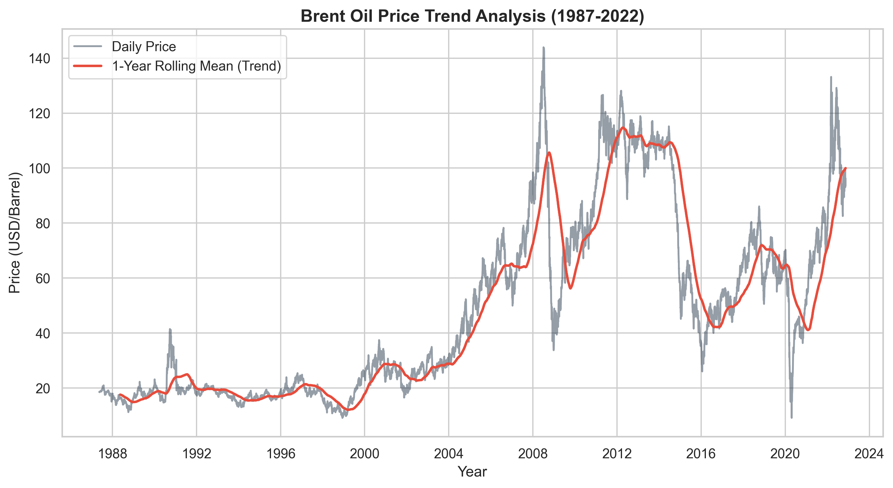
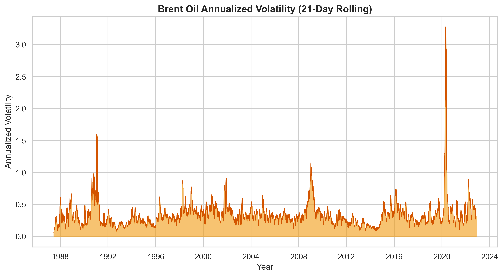

# Task 1 Report: Analysis Foundation & Time Series Properties

**To:** Stakeholders of Birhan Energies  
**From:** Data Science Team  
**Date:** February 9, 2026  
**Subject:** Foundation for Change Point Analysis of Brent Oil Prices (1987-2022)

---

## 1. Business Objective & Context

As a leading consultancy, **Birhan Energies** is committed to providing actionable intelligence for the energy sector. The global oil market is characterized by extreme volatility driven by geopolitical shocks, economic transitions, and policy shifts.  

The objective of this analysis is to quantify how major events—such as **OPEC policy changes, international sanctions, and conflicts in oil-producing regions**—impact Brent crude oil prices. This understanding is critical for our key stakeholders:
*   **Investors:** To manage risk, hedge portfolios, and maximize returns in unstable markets.
*   **Policymakers:** To design strategies for national energy security and economic stability.
*   **Energy Companies:** To optimize operations, secure supply chains, and forecast costs with higher precision.

---

## 2. Completed Work & Initial Analysis

### 2.1 Data Analysis Workflow
Our team has established a robust, systematic workflow to ensure analytical integrity:
1.  **Data Ingestion:** Standardized loading of historical EIA daily price data.
2.  **Exploratory Analysis (EDA):** Statistical profiling of price distributions and volatility.
3.  **Event Research:** Compilation of a high-fidelity dataset of 15+ geopolitical "shocks."
4.  **Bayesian Modeling:** Implementation of PyMC change point models.
5.  **Causal Association:** Quantifying shifts in parameters ($mu, sigma$) around suspected dates.
6.  **Insight Delivery:** Communication via interactive dashboards and policy briefs.

### 2.2 Event Research Summary
We have compiled a structured dataset of 16 key events. Notable examples include:
*   **1990-08-02:** Iraq Invades Kuwait (Supply Shock).
*   **2008-07-11:** GFC Price Peak (Financial Crash).
*   **2020-03-11:** COVID-19 Pandemic Declaration (Demand Collapse).
*   **2022-02-24:** Invasion of Ukraine (Geopolitical Energy Security Crisis).

### 2.3 Initial Time Series Findings
Our initial investigation reveals three critical properties of Brent prices:

**Trend & Stationarity:**  
The price series is **non-stationary** (ADF p-value: 0.29), showing long-term trends and structural breaks. However, daily percentage returns are **highly stationary** (ADF p-value: <0.001), serving as the ideal candidate for change point detection.

*Figure 1: Long-term Brent oil price trend with 1-year moving average.*

**Volatility Patterns:**  
Volatility is not constant but "clusters" during crises. The transition from relative stability to extreme volatility (heteroscedasticity) is a primary indicator of structural regimes.

*Figure 2: Annualized 21-day rolling volatility showing massive clusters in 2008 and 2020.*

### 2.4 Change Point Model Understanding
Our approach utilizes **Bayesian Change Point Detection** via PyMC. Unlike simple moving averages, these models identify the exact date ($\tau$) where the probabilistic distribution of prices shifted.
*   **Output:** Predictive distributions for prices, posterior probabilities of change dates, and quantified shifts in mean ($\mu$) and volatility ($\sigma$).
*   **Limitation:** While the model detects "structural breaks," associating them with events provides temporal **correlation**, not absolute proof of causality—this requires the qualitative context provided by our event research.

---

## 3. Assumptions & Limitations

*   **Assumption of Exogeneity:** We assume major geopolitical events are external drivers of oil prices, though we acknowledge the feedback loop where high oil prices can further fuel regional conflicts.
*   **Correlation vs. Causality:** Statistical change points tell us *when* a shift happened. Proving *why* it happened (causality) requires aligning these points with our Compiled Event Dataset and ruling out confounding variables.

---

## 4. Next Steps & Roadmap

### Task 2: Bayesian Modeling & Impact Quantification
*   Run the PyMC MCMC sampler to detect specific change dates.
*   Compare pre-event and post-event regimes.
*   Verify model convergence using R-hat metrics and ArviZ.

### Task 3: Dashboard & Communication
*   **Backend (Flask):** Develop API endpoints to serve model results and event metadata.
*   **Frontend (React):** Build an interactive time-series dashboard allowing stakeholders to click on detected change points and view associated geopolitical context in real-time.

---
**Deliverables Status:**  
✅ Analysis Workflow Documented  
✅ 16-Event Structured Dataset Created  
✅ Initial Statistical EDA Completed  
✅ Bayesian Model Architecture Built  
